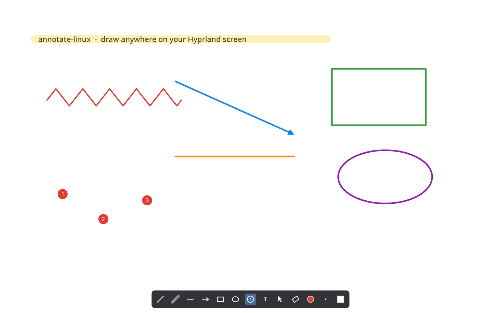

# annotate-linux

Keyboard-driven screen annotation for Wayland compositors with
wlr-layer-shell — Hyprland, Sway, river, niri. A Linux answer to
[Annotate for macOS](https://github.com/epilande/Annotate): toggle a
transparent overlay above every window, draw, present, clear, get out of
the way.

Native Rust + smithay-client-toolkit + cairo. No GTK, no Electron, no
XWayland. Fractional scale (e.g. 1.6) renders pixel-crisp via
`wp_fractional_scale_v1` + `wp_viewporter`.



## Features

- **Tools:** pen, highlighter (self-crossing-safe translucency), line,
  arrow, rectangle, ellipse, numbered counter badges, single-line text
  (click to place, double-click to edit, drag to reposition), select
  (click / marquee, move, copy/cut/paste/duplicate), object eraser
  (sweep removes whole objects; one undo restores the sweep)
- **Constraints:** Shift = square / circle / 45° snapping, Alt =
  center-expand
- **Modes:** persist (default), fade (annotations dissolve after N
  seconds), always-on passthrough (annotations stay visible, clicks and
  keys go to the apps below)
- **UI:** in-overlay toolbar, color palette popup (`c`), width slider
  (`w`, or Ctrl+scroll anywhere), whiteboard/blackboard (`b`) with
  adjustable opacity
- **Cursor:** spotlight highlight, click ripples, drawn cursor styles
  (outline / circle / crosshair)
- **System:** per-output scenes on multi-monitor (hotplug safe), undo/redo
  across everything, state persistence (last tool/color/width/board/fade
  survive restarts), rebindable keys, IPC CLI for scripting

## Install

Arch has a `PKGBUILD` in this repo (`makepkg -si`). Everywhere else, cargo
is the install path. rustc 1.92 or newer.

```sh
# Debian / Ubuntu build deps
sudo apt install pkg-config libcairo2-dev libwayland-dev libxkbcommon-dev

cargo build --release
install -Dm755 target/release/annotate-linux ~/.local/bin/annotate-linux
```

Runtime deps: `cairo`, `libxkbcommon`, `wayland`. You need a compositor
that speaks `zwlr_layer_shell_v1` (Hyprland, Sway, river, niri, labwc,
Wayfire). GNOME and X11 are out.

## Compositor setup

Wayland has no global-hotkey API. Bind a key in the compositor to the
`annotate-linux` CLI. The CLI talks to the daemon socket. The daemon
starts on first command if it is not already running. The passthrough
bind is also the way back out of passthrough. The overlay takes no input
in that mode.

### Hyprland

```conf
exec-once = annotate-linux daemon
bind = SUPER,       A, exec, annotate-linux toggle
bind = SUPER SHIFT, A, exec, annotate-linux passthrough
bind = SUPER CTRL,  A, exec, annotate-linux clear
layerrule = no_anim on, match:namespace annotate-linux
```

Hyprland older than 0.53 uses `layerrule = noanim, annotate-linux`.

### Sway

```
exec annotate-linux daemon
bindsym $mod+a exec annotate-linux toggle
bindsym $mod+Shift+a exec annotate-linux passthrough
bindsym $mod+Ctrl+a exec annotate-linux clear
```

### niri

```kdl
spawn-at-startup "annotate-linux" "daemon"

binds {
    Mod+A { spawn "annotate-linux" "toggle"; }
    Mod+Shift+A { spawn "annotate-linux" "passthrough"; }
    Mod+Ctrl+A { spawn "annotate-linux" "clear"; }
}
```

## Keys (while the overlay is up)

| Key | Action | Key | Action |
| --- | --- | --- | --- |
| `p` | pen | `s` | select |
| `h` | highlighter | `x` | eraser |
| `l` | line | `c` | color picker |
| `a` | arrow | `w` | width picker |
| `r` | rectangle | `b` | board cycle |
| `e` | ellipse | `Esc` | hide (always) |
| `n` | counter | `Delete` | delete selection |
| `t` | text | `Ctrl+scroll` | width |
| `Ctrl+z` / `Ctrl+Shift+z` | undo / redo | `Ctrl+c/x/v/d` | clipboard |
| `Ctrl+r` | reset counter | | |

Rebind anything in `[keys]` (see
[contrib/config.example.toml](contrib/config.example.toml)).

## CLI

```
annotate-linux toggle | show | hide
              | passthrough [on|off]
              | clear | undo | redo
              | tool <name> | color <#rrggbb|next|prev|N> | width <n|+n|-n>
              | board <none|white|black> [--opacity 0.85]
              | mode <fade|persist> [--seconds 3]
              | cursor <style> [--highlight true]
              | export [path] | copy
              | counter-reset | status | reload-config | quit
```

`status` prints JSON. `export` renders the annotations to a PNG
(transparent background unless a board is active; works with the overlay
hidden too); `copy` puts that PNG on the clipboard via wl-copy. Config lives at
`~/.config/annotate-linux/config.toml`, runtime state at
`~/.local/state/annotate-linux/state.toml`.

## Known limitations (v1)

- Text uses cairo's toy font API: no shaping, no font fallback — CJK,
  RTL, and emoji render as boxes. Pango integration is the planned fix.
- No IME support in the text tool.
- Single-line text only.
- The highlighter approximates marker ink with alpha compositing; a true
  multiply against screen content is impossible from a Wayland overlay
  (clients cannot read what is beneath them).
- In fade mode, a fully faded object remains clickable/erasable for a ~2s
  grace window before garbage collection removes it.

## License

MIT
